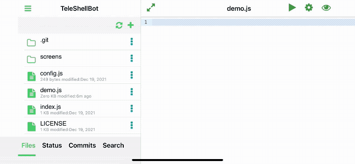
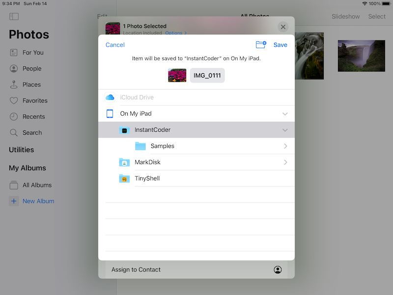

## Features

### Git client
As a git client, the app supports the following git operations:
- clone
- pull
- push
- create branch and switch branch
- commit / merge
- diff

### Editor
#### Syntax highlighting
All mainstream programming languages: css, js, html, swift, objective-c, c/c++, java, python, R, etc

#### Code autocompletion and execution
Esepcially, MarkGit has extensive support to javascript/typescrit, including code intelligence.

You can also run code in few languages including javascript/trype, java, python, c, R.

#### Markdow support
MarkGit shared the same markdown parser engine with [marknote](https://marknoteapp.com/) which supports not only the full
[Github flavored markdown featuers](https://marknoteapp.com/doc/Markdown%20Quick%20Reference) but also [extended markdown syntax](https://marknoteapp.com/doc/extended%20markdown) 

#### Keyboard shortcuts

[shortcuts](../shortcuts/)

## FAQ
### How to import images / files?

The file system of MarkGit is open and can be viewed by other apps, like Apple's Files app.   
There are many ways you can add images / files into MarkGit. 
For example, in iOS Photos app, choose a photo -> Share -> Save to Files -> On my iPhone/iPad -> MarkGit

Then you will be able to see the newly added image in MarkGit
