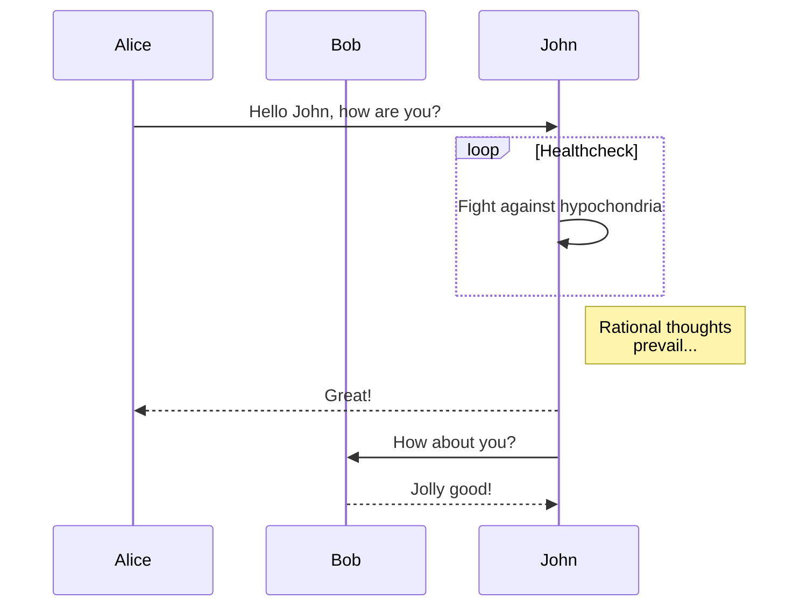

# mermaid
MarkNote now supports drawing diagrams and flowcharts with [mermaid](https://github.com/knsv/mermaid).

## Input

<pre>
<code>

</code>
</pre>

## Output

You can check [mermaid syntax reference](http://knsv.github.io/mermaid) for more details.